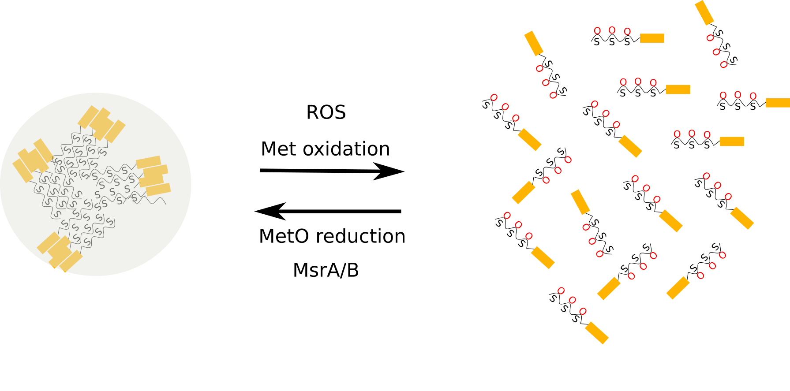

```{r setup, include=FALSE}
knitr::opts_chunk$set(echo = TRUE)
```

Alongside classic organelles such as mitochondria and lysosomes, there exist numerous membraneless organelles present as liquid droplets within the cell, contributing to its compartimentalization. 

These dynamic structures are condensates of macromolecules that are reversibly assembled in response to stimuli, during a process termed liquid–liquid phase separation. In recent years, phase separation has gain interest as a novel principle of cellular organization and regulation. 

Indeed, the resulting assemblies concentrate certain molecules while excluding others, and hence, can speed up or slow down biochemical reactions and contribute to compartmentalize the biological processes taking place within the living cell. However, when it comes to how cells form these structures in a regulated way, there are still more questions than answers. For this reason, we would like to highlight a recent breakthrough in this area, with the identification of reversible methionine oxidation as a redox sensor involved in the dynamic assembly of membraneless organelles.




Stress granules are dense aggregations in the cytosol composed of proteins and RNAs that appear when cells are under stress. A relevant constituent of the stress granules is ataxin-2, an intrinsically disordered protein with an increasingly larger number of known molecular functions. Recently, the group led by Benjamin Tu has unraveled a prominent role for methionyl residues from Pbp1 (the yeast orthologous of ataxin-2) in the formation of intracellular drop-like condensates. These researchers have presented convincing evidences that methionine residues from the low-complexity domain of Pbp1 are components of a redox sensor, which constitutes a receptor for ROS produced by mitochondria in response to the nutrient environment. These authors showed that:

* These methionine residues are required, both _in vivo_ and _in vitro_, for the formation of condensates.
* Oxidation, in both test tube reactions and living cells, of these residues leads to the melting of these liquid-like droplets.
* In vitro, hydrogen peroxide-mediated melting of these structures is fully reverted by the enzymatic reduction of methionine oxidation in the presence of MsrA and MsrB (methionine sulfoxide reductase enzymes).


Owing to the fact that the low-complexity domain of human ataxin-2 presents 18 evolutionary conserved methionines, one can speculate that the human protein may perform an analogous mechanistic function to that described above for Pbp1 in the yeast. 

The question that arises is: could other membraneless organelles exploit this redox property of methionine residues to regulate their assembly? Resorting to the arguments developed by the great biologist François Jacob, evolution always starts with what is already available and reuses successful designs repeatedly in slightly modified variations. Once we know that reversible methionine sulfoxidation is a successful solution to assemble tailored microenvironments that are established and maintained without the need of membranous structures, it is very likely that new and exciting findings are awaiting us ahead.

### Further readings

Redox state controls phase separation of the yeast ataxin-2 protein via reversible oxidation of its methionine-rich low-complexity domain. [Cell. 2019; 177:711–721.](https://www.ncbi.nlm.nih.gov/pubmed/30982603)

The molecular language of membraneless organelles. [J Biol Chem. 2019; 294:7115–7127.](https://www.ncbi.nlm.nih.gov/pubmed/30045872)

Methionine in proteins: the Cinderella of the proteinogenic amino acids. [Protein Sci. 2019; 28:1785-1796.](https://www.ncbi.nlm.nih.gov/pubmed/31359525) 
