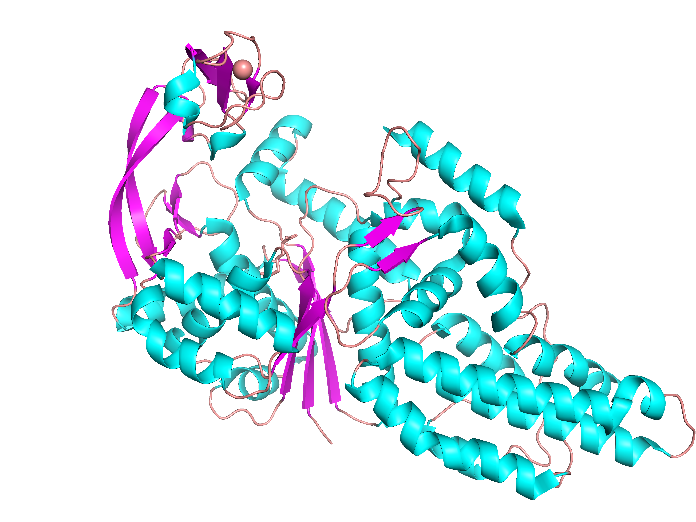
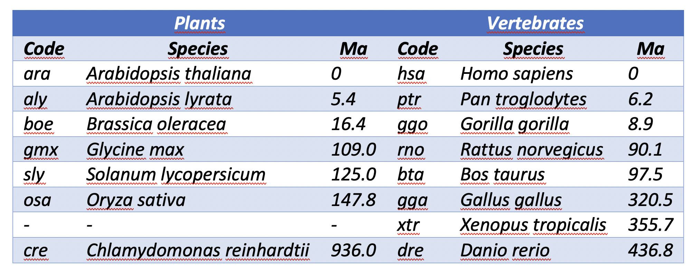

```{r setup, include=FALSE}
knitr::opts_chunk$set(echo = TRUE)
library(ptm)
library(knitr)
```

### Description
Downloads orthologous sequences and carries out their alignment.

### Usage
custom.aln(target, species, molecule = 'protein')

### Arguments
_target_	the KEGG identifier of the protein of interest.

_species_  a character vector containing the KEGG code for the species of interest.

_molecule_ a character string specifying the nature of the sequence; it must be one of 'dna', 'protein'.


### Value

Returns a list of class "fasta" with three components: 'ali' (an alignment character matrix with a row per sequence and a column per residue), 'id' (sequence identifiers) and 'call' (the matched call).

### References
Edgar RC. [Nucleic Acids Res. 2004 32:1792-1797](https://www.ncbi.nlm.nih.gov/pmc/articles/PMC390337/).
Edgar RC. [BMC Bioinformatics 5(1):113](https://www.ncbi.nlm.nih.gov/pmc/articles/PMC517706/).

### See Also
msa(), list.hom(), parse.hssp(), get.hssp(), shannon()

### Details

Multiple sequence alignment (MSA) is generally the alignment of three or more biological sequences. From the output, homology can be inferred and the evolutionary relationships between the sequences studied. Thus, alignment is the most important stage in most evolutionary analyses. In addition, MSA is also an essential tool for protein structure and function prediction. The package _ptm_ offers several functions that will assist you in the process of sequence analysis:

[msa](/msa)
custom.aln (current doc)
[list.hom](/list.hom)
[parse.hssp](/parse.hssp)
[get.hssp](/get.hssp)
[shannon](/shannon)
[site.type](/site.type)

The function **custom.aln()** carries out MSAs implementing the program [MUSCLE](https://www.drive5.com/muscle/), which you must have intalled in your machine previously. MUSCLE is a fast multiple sequence alignment program available from the muscle home page. Details to guide you through the installation of MUSCLE can be found [here](/installing).

In addition to call MUSCLE to perform the alignment, **custom.aln()** will also serch for and download the requested orthologous sequences for you. So, you just have to worry about prividing a list with the species you are interested in. For instance, suppose we have been examining the following structure, which corresponds to the methionyl-tRNA synthetase of _Escherichia coli_. 



If, as a first approach, we wish to have an impression of which regions of this protein are most conserved and which have diverged the most throughout evolutionary time, we can carry out an alignment of our target protein with the sequences from sets of pre-established species.



To achieve this, the only data we have at hand is the PDB ID of the above structure: 1PFV. Enough!


```{r}
custom.aln(target = id.mapping(id = '1pfv', from = 'pdb', to = 'kegg'), species = 'vertebrates')
```

We may wish repeat the analysis, but now comparing the bacterial protein with that from plants:

```{r}
custom.aln(target = id.mapping(id = '1pfv', from = 'pdb', to = 'kegg'), species = 'plants')
```

Perphaps, at this point we would like to compare our target with much more sequences but in a narrower time window. In this case we should pass set either species = 'one-hundred' or species = 'two-hundred':

```{r}
custom.aln(target = id.mapping(id = '1pfv', from = 'pdb', to = 'kegg'), species = 'one-hundred')
```

If we wonder what species is, for instance, 'see', all we have to type is:

```{r}
species.kegg('see', from = '3-letter')
```

Of course, we can make a taylored list of species:

```{r}
yeast <- species.kegg('budding yeast', from = 'vulgar')
human <- species.kegg('Homo sapiens', from = 'scientific')
species <- rbind(yeast, human)
species
```

and then run the alignment

```{r}
custom.aln(id.mapping(id = '1pfv', from = 'pdb', to = 'kegg'), species = species$organism)
```

If instead of proteins we want to align DNA sequences, all we should do is pass the argument molecule = 'dna' to the function **custom.aln()**:

```{r}
custom.aln(target = id.mapping(id = '1pfv', from = 'pdb', to = 'kegg'), 
           species = species$organism,
           molecule = 'dna')
```


