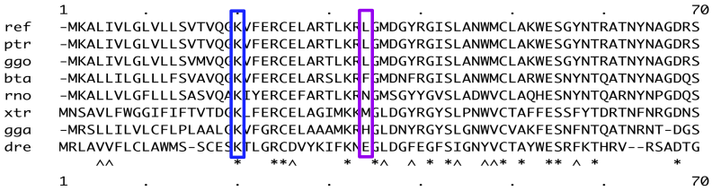

```{r setup, include=FALSE}
knitr::opts_chunk$set(echo = TRUE)
library(ptm)
library(knitr)
```

### Description
Computes Shannon's entropies and performs a partition of the sites set.

### Usage
site.type(target, species, th = 0.25)

### Arguments
_target_ the KEGG identifier of the protein of interest.

_species_ a character vector containing the KEGG code for the species of interest.

_th_ value between 0 and 1 indicating the percentil driving the site partition.

### Value
Returns a dataframe including the category of each site according to its variability.


### See Also
msa(), custom.aln(), list.hom(), parse.hssp(), get.hssp(), shannon()

### Details

Multiple sequence alignment (MSA), which consists in the alignment of three or more biological sequences. From the output, homology can be inferred and the evolutionary relationships between the sequences studied. Thus, alignment is the most important stage in most evolutionary analyses. In addition, MSA is also an essential tool for protein structure and function prediction. The package _ptm_ offers several functions that will assist you in the process of sequence analysis:

[msa](/msa)
[custom.aln](/custom.aln)
[list.hom](/list.hom)
[parse.hssp](/parse.hssp)
[get.hssp](/get.hssp)
shannon (current doc)
[site.type](/site.type)

The entropy of a random variable is a measure of the uncertainty of that variable. If we define a random variable, X, as the residue found at a given position in a MSA, then the entropy of X will measure the uncertainty regarding the residue found at that position in the alignment. That is, the higher the entropy the more uncertain one is about the amino acid one can find at that position. 

The function **shannon()** will compute, for each position in a alingment, the so-called [Shannon entropy](https://en.wikipedia.org/wiki/Entropy_(information_theory)) of the random variable X, defined as the residue (or codom) found at that given position. Therefore, a preliminar step involves finding a MSA of the _target_ sequence with the orthologous sequences of the especified _species_. Then, for each position in this alignment the Shannon entropy is computed. 

Shannon defined the entropy H, of a discrete random variable X, as:

$latex H(X) := E[-log_2(P_X(X))]$

where E is the expected value operator, and P_X(X) is the probability mass function of X. Thus, applying the definition of expected value:


$latex H(X) := E[-log_2(P(X))] = - \sum_{x_i \in R_X} P_X(x_i) log_2(x_i) $

where $latex R_X$ is support of X, that is the set of all the realizations that have a strictly positive probability of being observed. 

Shannon postulated that an average of the uncertainty of random variables should be a continuous function of the probability distribution (probability mass function) satisfying:

* It must be maximum when the probability distribution is uniform. In this case, it must increase when the cardinal of the support, $latex |R_X|$, increases.

* It must be invariant against rearrangements of the probability assigned to the different values of X.

* The uncertainty about two independent random variables must be the sum of the uncertainties of each of them.

Shannon proved that the only uncertainty measure that satisfies such requirements is the Shannon entropy, H(X), as we have defined it above.

To illustrate the computation, let's work with the following toy alignment





First, we will compute the H(X) for position 20 (blue rectangle). This computation is going to be straightforward. The support is R_X = {K} and P_X(X = K) = 1. Thus, $latex H(X) = - 1 log_2(1) = 0$. Now, let's focus on the position 34 (purple rectangle):

$latex H(X) = -[\frac{3}{8} log_2(\frac{3}{8}) + 5 (\frac{1}{8} log_2(\frac{1}{8})] = 2.406$

Although it is not obvious at first glance, the entropy, as defined by Shannon, has a very concrete interpretation. 
Suppose X takes a radom value from the distribution P_X(X), and anyone who knows this distribution is asked to determine the realization of X (the taken value) by asking question that can be answered 'yes' or 'no', If this person uses an optimal strategy, that is he/she restricts the set of possible values to half in each question, then the average number of question necessary to arrive at the value of X will be between H(X) and H(X) + 1.

At this point, it is time to see **shanno()** in action. To this end we will use the human lysozime (UniProt ID: [P61626](https://www.uniprot.org/uniprot/P61626)). Since to compute the Shannon entropy, we have to carry out an alignment, you can select the species of interest to be included in the alignment, but if all you are interested in is to get an impresion of the uncertainty at each position (that is, you don't mind what species are included), you can select any of the pre-established list of especies (one among: 'vertebrates', 'plants', 'one-hundred', 'two-hundred').

First, we compute the Shannon entropy considering an alphabet of 21 letters, H21, (one per proteinogenic amino acid plus the gap symbol):

```{r}
lyz21  <- shannon(target = id.mapping('P61626', from = 'uniprot', to = 'kegg'),  
               species = 'two-hundred',
               base = 2,
               alphabet = 21)
```

We can plot the entropy as a function of the position:

```{r}
plot(lyz21$n, lyz21$Haa, ty = 'b', xlab = 'Position', ylab = 'Shannon Entropy')
points(lyz21$n[which(lyz21$Haa < 0.25)], lyz21$Haa[which(lyz21$Haa < 0.25)], pch = 19, col = 'blue')
points(lyz21$n[which(lyz21$Haa > 3)], lyz21$Haa[which(lyz21$Haa > 3)], pch = 19, col = 'red')
```

Thus, as a first approch to the study of variability, **shannon()** can give us an idea of the sites highly variable (red) and those that are conserved (blue). However, it may happen that some sites show some degree of variability (uncertainty) but the amino acids admited into these sites must exhibit similar physichochemical properties (conservative changes). In this case, we would like to compute the Shannon entropy using a 4-letter alphabet, H4, (charged, hydrophobic, polar and spetial residues). In this way, comparing H21 and H4, we can perform a partition of the sites set. To this end, we can use the function **site.type()**:

```{r}
sites <- site.type(id.mapping('P61626', from = 'uniprot', to = 'kegg'), species = 'two-hundred', th = 0.25)
```

Each site from the alingment is labelled as:

* invariant: H21 = H4 = 0 (blue)
* pseudo-invariant: H4 = 0 < H21 (purple)
* constrained: H21 < percentil & H4 < percentil (cyan)
* conservative: H21 > percentil & H4 < percentil (aquamarine)
* unconstrained: H21 > percentil & H4 > percentil (orange)
* drastic: H21 < percentil & H4 > percentil (red)

where percentil is the value of H21 or H4 corresponding to the percentil indicated by the argument th.


