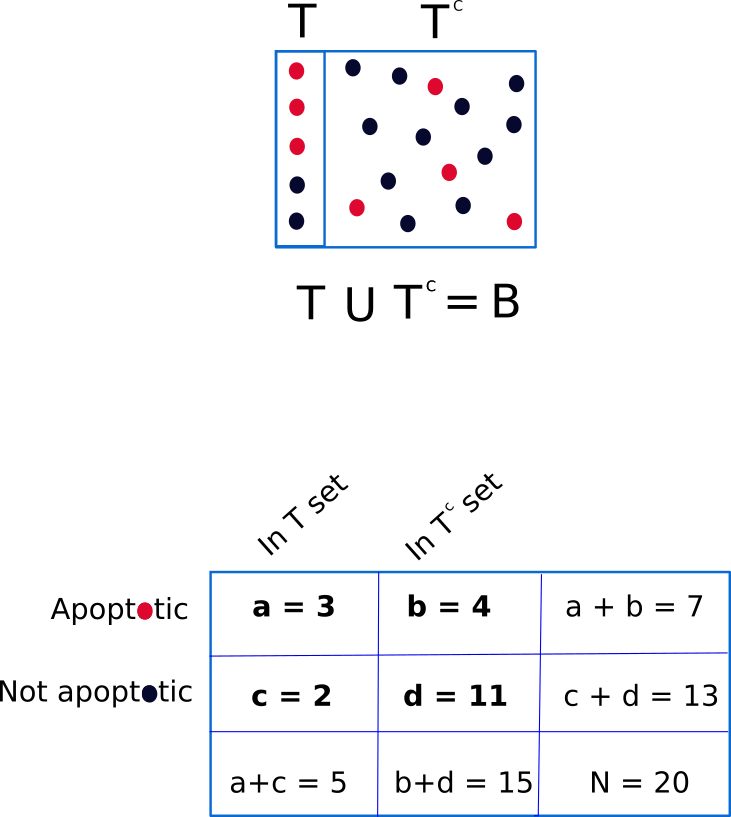
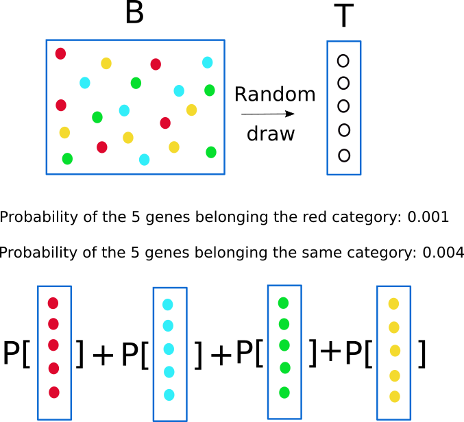
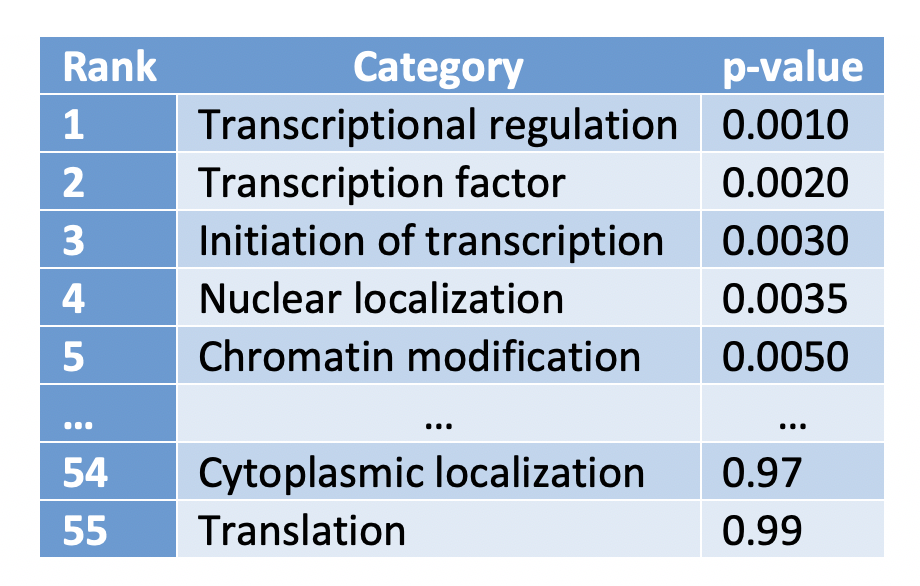
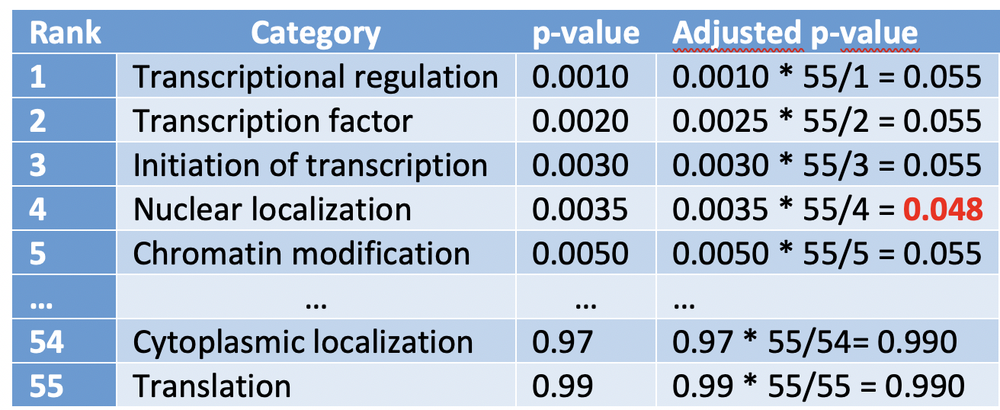
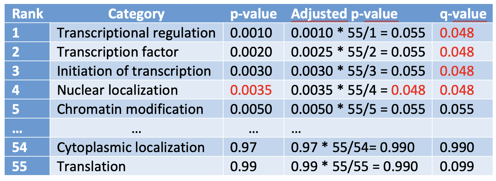

```{r setup, include=FALSE}
knitr::opts_chunk$set(echo = TRUE)
library(ptm)
library(knitr)
```

### Description
Gets core information about the GO term of interest.

### Usage
term.go(go, children = FALSE)

### Arguments
_go_	GO id.

_children_ logical. When the argument children is set to TRUE, information about children terms is retrieved.

### Value

Returns by default a dataframe containing core information such as term name and definition, reference, aspect, and whether or not the term is obsolete. Nevertheless, if the argument children is set to TRUE the output of this function is a list with two element: the first one is a dataframe with the core information, and the second one is a dataframe containing the children terms.

### References
Rhee, Wood, Dolinkski & Draghici, [Nature Reviews Genetics 2008, 9:509–515](https://pubmed.ncbi.nlm.nih.gov/18475267/).

### See Also
term.go(), get.go(), go.enrich(), gorilla() 

### Details

The [Gene Ontolory project](http://geneontology.org/) (GO) provides a controlled vocabulary to describe gene and gene product attributes. Thus, a GO annotation is a statement describing some biological aspect. GO annotations are created by associating a gene or gene product with a GO term. Together, these statements comprise a “snapshot” of current biological knowledge. Hence, GO annotations capture statements about three disjoint categories: cellular component, molecular function and biological process. In this way, GO terms, using a controlled and hierarchical vocabulary, help to describe how a gene functions at the molecular level, where in the cell it functions, and what biological processes it helps to carry out.

The use of this vocabulary (GO annotations) has diverse applications, perhaps the most popular of them is the functional profiling. The goal of functional profiling is to determine which processes might be different in particular sets of genes (or gene products). That is, GO annotations are used to determine which biological processes, functions, and/or locations are significantly over- or under-represented in a given group of genes (or gene products). This approach is also known as GO term enrichment analysis.

Whenever we have a set of genes that are differentially expressed between different conditions (for example, cancerous versus healthy), we can apply GO enrichment analyses. For the sake of concretion let's build some toy data that may be useful to illustrate the theory behind the GO term enrichment analysis. So, suppose we have analysed the expression of 20 genes (N = 20) in cancerous and healthy cells. Let's continue imagining: among these 20 genes, 5 of them are differentially expressed between the two conditions. This set of differentially expressed genes constitutes our target set (T), the remaining 15 genes belong to the complementary set ($latex T^c$). Please, note that the union of these two sets gives the background set.

At this point, we must be aware that two types of questions can be addressed when performing functional profiling: 

* Hypothesis-generating query.
* Hypothesis-driven query.

In the former (hypothesis-generating query) we assess which GO terms are significant in our target set, while in the later (hypothesis-driven query) we evaluate whether, for instance, apoptosis (or any other preselected process, function or component) is significantly enriched or depleted in our target set. Let's start with the latter. 

Thus, we start computing how many of the 20 genes forming the background set (B), are related to apoptosis and how many of the 5 differentially expressed genes are linked to apoptosis. Suppose, that after performing that computations we obtain the following result: 





We can observe that the proportion of genes related to apoptosis within the target set is (3/5 = 0.6) much higher than that in the background set (5/20 = 0.25), but ..., what can we conclude? The main problem here is that any enrichment value can occur just by chance. That is, we need an appropriate statistical model. Thus, we define our random variable X as the number of genes in the target set that are related to apoptosis. Now, as a first approach, we can assume that X follows a binomial distribution with parameters p = 7/20 (probability of randomly pick an apoptotic gene from the background set) and n = 5 (cardinal of the target set). That is, $latex X \sim Bin(p = 0.35, n = 5)$. Therefore, the probability of getting just by random three apoptotic genes in the target set would be:  $latex P[X = 3] = \binom{5}{3} 0.35^3 0.65^2 = 0.181$. If we want to estimate the p-value, using the binomial model, we have to estimate the following probability:  

```{r}
1- pbinom(2, size = 5, p = 0.35)
```

$latex p-value = P[X \geq 3] = 0.235$ 

A valid critic to the model we have chosen (the binomial one) is that the binomial model assume sampling with replacement, that is, that the probability of picking from the background set a second gene (or protein) related to apoptosis once we have drawn a first apoptotic gene remain constant. However, such an assumption may not be acceptable, especially when the cardinal of the background set is not very high. For instance, in our toy example, the probability of picking an apoptotic gene is 7/20, but the probability of obtaining a second apoptotic gene is 6/19, and for a third one would be 5/18. Under these circumstances, a better suited model is the hypergeometric distribution ($X \sim HG(N, K, n)$) that describes the number of success (number of apoptotic genes in the target set) in a sequence of $n$ draws (cardinal of the target set) from a finite population (the background set of cardinal N) without replacement. Now, using this HG model we are going to compute again the probability of getting 3 apoptotic genes in our target set just by chance, to this end we will use the probability mass function of the hypergeometric distribution. $P[X = 3] = \frac{\binom{7}{3} \binom{13}{2}}{\binom{20}{5}}$

```{r}
dhyper(3, 7, 13, 5)
```

Again, to compute the p-value we have to resort to the cumulative distribution function instead to the probability mass function. That is, $P[X \geq 3] = \sum_{i=3}^5 \frac{\binom{7}{i} \binom{13}{5-i}}{\binom{20}{5}}$

```{r}
1- phyper(2, 7, 13, 5)
```

In general, if we have summarized the results in a contingency table as the one shown in the figure above, the question we want to answer is: knowing that we have $a + b$ genes related to the process (function or component) of interest in the background set, which is formed by $N$ genes, and assuming the null hypothesis (any observed enrichment is due to chance), what is the probability that the these genes of interest would be so unevenly (or even more) distributed as in our observation? In other words, what is the probability of observing data as extreme or more extreme than our observation? To answer this question we use, as we have already noted, the hypergeometric distribution, although in this context we may refer to the statistic model as the Fisher's exact test. In any case, the reasoning is as follows: In a population of $N$ genes, we have $a + b$ belonging to the process of interest. Now, if we randomly draw (that is the null hypothesis) $a + c$ genes from the background set, what is the probability that $a$ of them would belong to the process of interest? 

$P[X = a] = \frac{\binom{a+b}{a} \binom{c+d}{c}}{\binom{N}{a+c}} = \frac{(a + b)! (c + d)! (a + c)! (b + d)!}{a! b! c! d! N!}$

To obtain the p-value, the probability we have to compute is $P[X \geq a]$, which can be expressed as $1 - F_X(a -1)$, where $F_X$ is the cumulative distribution function of the random variable X. Remember that $F_X(x) = P[X \leq x]$. In R:

```{r}
#  p-value = 1 - phyper(a-1, a+b, c+d, a+c)
```

If instead of an enrichment test we would like to perform a depletion test, using the same contingency table we should compute: $P[X \leq a] =  F_X(a)$:

```{r}
#  p-value = phyper(a, a+b, c+d, a+c)
```


Hitherto, we have addressed the so-called hypothesis-driven approach. Now, we will present the hypothesis-generating one. In this approach we wonder what GO terms are significantly enriched in our test set. To this end, instead of performing a single test as the one we have described to test for  enrichment of apoptotic genes, we carry out multiple tests for different categories of genes. Whenever using this second approach, it is important to correct for the fact that many test performed in parallel will greatly increase the number of false positives in the target set. For instance, in the background set shown in the figure above, suppose that the 20 genes belong to 5 disjoint GO categories. If we pick randomly 5 genes from this background set, the probability of the 5 being from the GO category 'red' is 

```{r}
dhyper(5, 7, 13, 5)
```

this probability is as low as 0.001. However, if we compute the probability of the 5 genes belonging to the same category, we find that this probability has been multiplied by the number of tests we have to performed (as many as colors are being tested). 



Thus, it is obvious that we have to make a correction for multiple tests. The simplest correction would multiply the p-values of all terms with the number of parallel test performed. This correction is known as the Bonferroni correction. Bonferroni correction is very stringent, that is, the Bonferroni correction can be too conservative in the sense that while it reduces the number of false positives, it also reduces the number of true discoveries. The False Discovery Rate (FDR) approach is a more recent development. This approach also determines adjusted p-values for each test. However, it controls the number of false discoveries in those tests that result in a discovery (i.e. a significant result). Because of this, it is less conservative that the Bonferroni approach and has greater ability (i.e. power) to find truly significant results. The FDR threshold is often called the q-value. Another way to look at the difference between p-values and q-values is that a p-value of 0.05 implies that 5% of all tests will result in false positives, while  q-value of 0.05 implies that 5% of significant tests will result in false positives. 

How do we compute the q-value? To illustrate its calculation, suppose we have carried out 55 tests for as many GO categories, and the results obtained, ranked from lowest to highest p-value, were:


We are going to add a new column to this table to shown the "adjusted p-value", which is computed as the p-value times the number of test divided by the rank:


We have emphasized with red the adjusted p-value lower than our significance level ($\alpha = 0.05$) with the highest rank number. Next, we assign this value to all the rows with a rank number lower than that:



Q-values can be compute from p-values using the **qvalue()** function from the qvalue package:

```{r}
# if (!requireNamespace("BiocManager", quietly = TRUE))
#     install.packages("BiocManager")
# 
# BiocManager::install("qvalue")
# 
# library(qvalue)
# p <- c(0.001, 0.002, 0.003, 0.0035, 0.005) # p-values vector
# qvalue(p = p) # computes the corresponding q-values
```


After this rather long introduction to GO term enrichment analysis,  let's point out that the package _ptm_ offers several functions that will assist you in the process of GO analysis:

[search.go](/search-go)
[term.go](current doc)
[get.go](/get-go)
[go.enrich](/go-enrich)
[gorilla](/gorilla)


Let's focus on the function **term.go()**. Suppose we are interested in knowing what term is linked to GO:0005886.

```{r, echo = TRUE, results = 'hide'}
t <- term.go('GO:0005886', children = TRUE)
parent <- t[[1]]
```

For instance, the term name:
```{r}
parent$term_name
```

its aspect:
```{r}
parent$aspect
```

a brief text description:
```{r}
parent$definition_text
```

We can also get a dataframe with its children terms:

```{r}
head(t[[2]])
```
