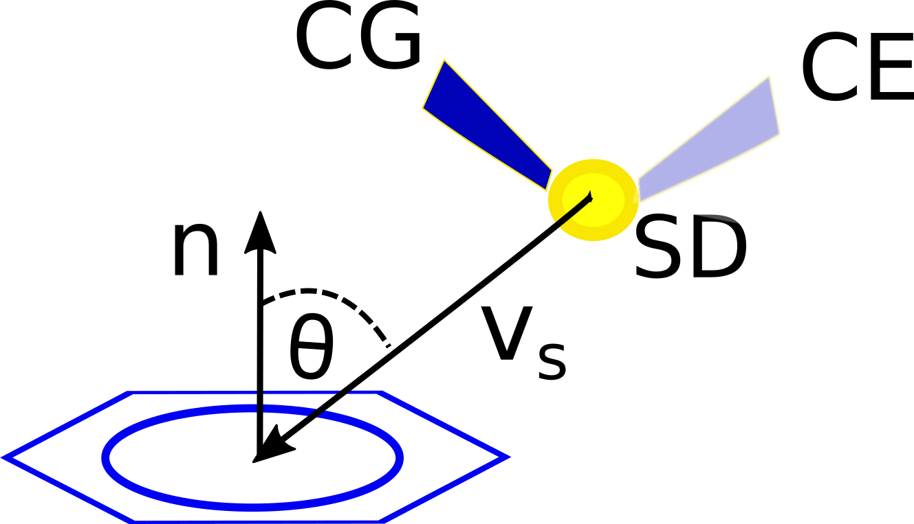

```{r setup, include=FALSE}
knitr::opts_chunk$set(echo = TRUE)
library(ptm)
library(knitr)
```

### Description
Computes distances and angles of S-aromatic motifs.

### Usage
saro.geometry(pdb, rA, chainA = 'A', rB, chainB = 'A')

### Arguments
_pdb_	either the path to the PDB file of interest or the 4-letters identifier.

_rA_ numeric position of one of the two residues involved in the motif.

_chainA_	a character indicating the chain to which belong the first residue.

_rB_	numeric position of the second residue involved in the motif.

_chainB_	a character indicating the chain to which belong the second residue.

### Value
The function returns a dataframe providing the coordinates of the sulfur atom and the centroid (centroids when the aromatic residue is tryptophan), as well as the distance (ångströms) and the angle (degrees) theta. Based on the distance (d) and the angle (theta) the user decide whether the two residues are considered to be S-bonded or not (usually when d < 7 and theta < 60º).

### References
Reid, Lindley & Thornton, [FEBS Lett. 1985, 190:209-213](https://doi.org/10.1016/0014-5793(85)81285-0).

### See Also
_saro.motif()_, _saro.dist()_

### Details

In the large inventory of the benefits provided by the presence of a sulfur atom in the side chain of methionine, we can find those effects derived from the so-called **S-aromatic motifs**. Indeed, an interaction of methionine and nearby aromatic residues (Phe, Tyr and Trp) was described as early as in the mid-eighties. Even earlier, a frequency of sulfur and aromatic ring in close proximity within proteins higher than expected had been noticed. Despite the potential importance of these findings, they went largely overlooked, perhaps because the physicochemical nature of this bond is only poorly understood. 

Although the strength of these interactions may depend on the conditions of its environment, it is accepted that the S-aromatic interaction occurs at a greater distance (5-7 Å) than a salt bridge (< 4 Å), while the energies associated with either interaction are comparable. More recently, extensive surveys of the Protein Data Bank have revealed the importance of the methionine-aromatic motif for stabilizing protein structures and for protein-protein interactions (see the review [*Methionine in proteins: The Cinderella of the proteinogenic amino acids*](https://onlinelibrary.wiley.com/doi/abs/10.1002/pro.3698) for further details).

When searching for S-aromatic motifs in proteins, two relevant variables are the distance between the delta sulfur atom (SD) and the centroid of the aromatic ring, which can be computed as the euclidean norm of the vector  $\mathbf{V_S}$ shown in the figure below


$d =  \lVert \mathbf{V_S} \rVert$


The other relevant variable is the angle theta. This angle is defined as that between the sulfur-aromatic vector ($\mathbf{V_S}$) and the normal vector of the aromatic ring ($n$). This angle is complementary to the angle of elevation of the sulfur above the plane of the ring. In the figure, CG, SD and CE stand for carbon gamma, sulfur delta and carbon epsilon of the methionine residue. In the figure, CG, SD and CE stand for carbon gamma, sulfur delta and carbon epsilon of the methionine residue. 

<style>
img {
  display: block;
  margin-left: auto;
  margin-right: auto;
}
</style>



Note that two extreme cases are possible: a face-on interaction (angles around 0º) and an edge-on interaction (involving angles around 90º).

Currently, the *ptm* package offers three functions that may be useful for the study of these S-aromatic motifs:

* [saro.dist](./saro.dist)                              
* saro.geometry (the current tutorial)                    
* [saro.motif](./saro.motif)

To illustrate the use of these functions we are going to use calmodulin (CaM) as a model protein. Calmodulin is a multifunctional calcium-binding protein expressed in all eukaryotic cells. The binding of the secondary messenger Ca2+ to CaM changes the CaM conformation and its affinity for its various targets. Methionine residues of CaM play an essential role in the sequence-independent specific binding to its many protein targets. In a Ca2+ free medium, CaM exhibits a spatial conformation corresponding to the so-called apoCaM (PDB ID: 1CFD). On the other hand, when CaM binds two Ca2+ ions, the protein adopt a different spatial conformation correspoonding to the holoCaM (PDB ID: 1CLL).

At the positions 141 and 145 we find a phenylalanine and methionine residues, respectively. Since CaM is a monomeric protein, we don't have to have to provide the arguments _chainA_ and _chainB_ to the function:

```{r, warning = FALSE}
cam <- saro.geometry('1CLL', rA = 141, rB = 145)
kable(cam)
```

We can observe that these residues form a S-aromatic motif close to the edge-on type, where the sulfur atom and the centroid of the aromatic ring are below 5 Å away.
