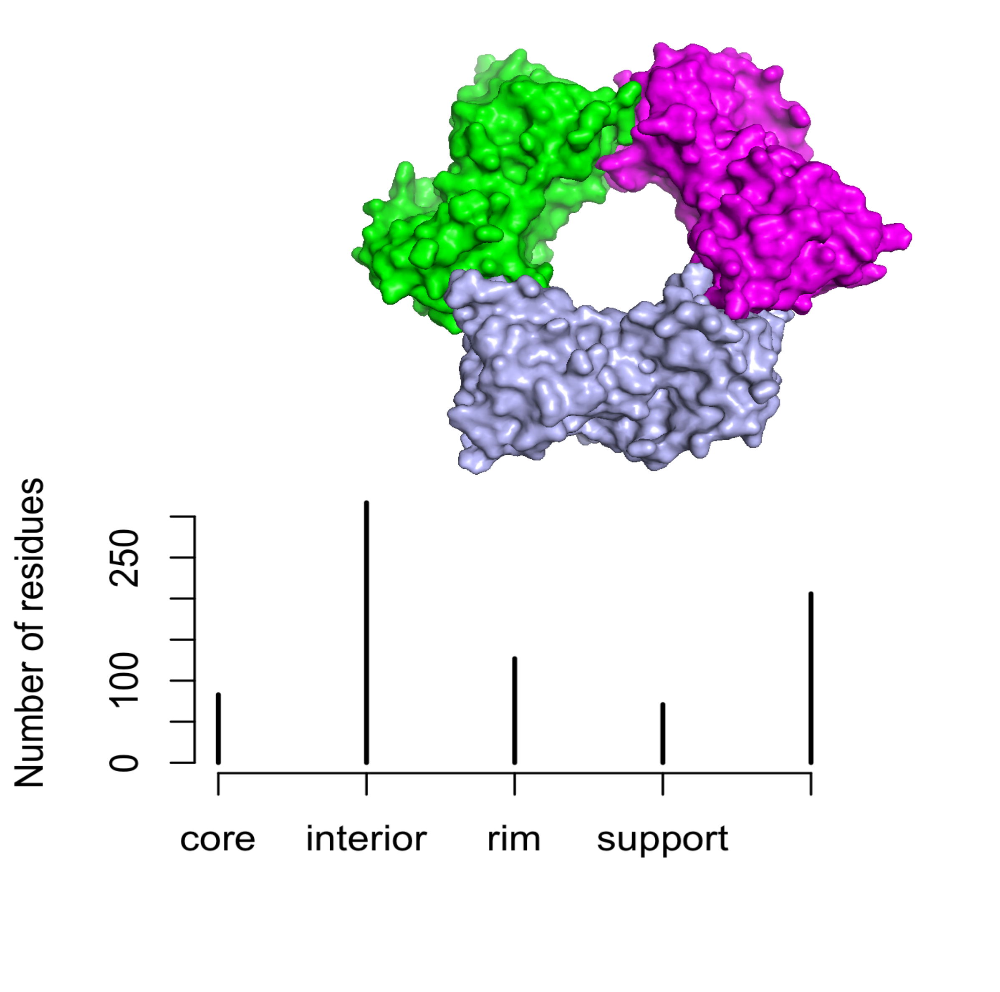
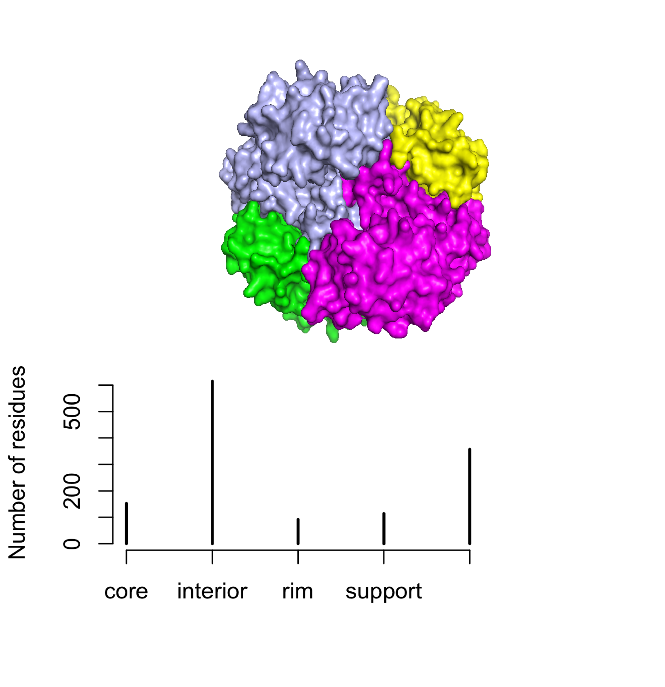
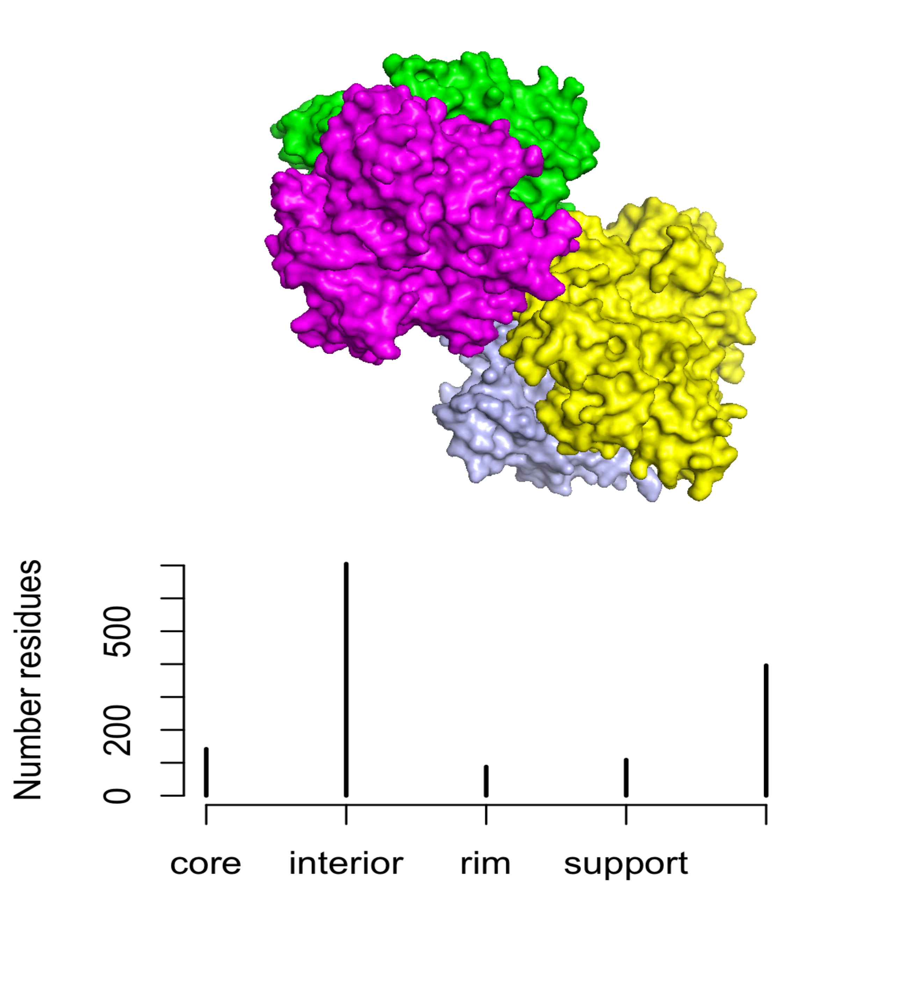

```{r setup, include=FALSE}
knitr::opts_chunk$set(echo = TRUE)
library(ptm)
library(knitr)
```

### Description
Carries out a partition of the estructural regions of a given protein.

### Usage
stru.part(pdb, cutoff = 0.25)

### Arguments
_pdb_	is either a PDB id, or the path to a pdb file.

_cutoff_ accessibility below which a residue is considered to be buried.

### Value
A dataframe where each residue is assigned to one of the four structural groups considered.

### References
Levy (2010) [J. Mol. Biol. 403: 660-670](https://www.ncbi.nlm.nih.gov/pubmed/20868694).

### Details

Analysis of protein commonly requires the partition of their structure into regions such as the surface, interior, or interface. Whenever you are interested into analysing such a partition in a particular protein, the following function of the _ptm_ package may be of help:

* [acc.dssp](/acc.dssp)
* [get.area](/get.area)
* [atom.dpx](/atom.dpx)
* [res.dpx](/res.dpx)
* stru.part (the current document)

It is always crucial to consider the structure of proteins when analyzing their biological properties. For [oligomeric](https://en.wikipedia.org/wiki/Protein_quaternary_structure) proteins, we can define four structural regions based on the solvent-accessible surface area ([SASA](https://en.wikipedia.org/wiki/Accessible_surface_area)) and relative accessibility (ACC) of its residues. For this purpose, the function **str.partition()** carries out the computation of the SASA for each amino acid in the comples (ACCc) and in the monomer (ACCm). Those residues for which DACC = (ACCm - ACCc) > 0 are designed as _interface_ residues and can be further sorted into _support_, _rim_ and _core_ according to the following criteria:

* support: DACC > 0 & ACCm < 0.25
* rim:  DACC > 0 & ACCc > 0.25
* core: ACCc < 0.25 & ACCm > 0.25

When a residue exhibits DACC = 0, this can belong to one of the following categories:

* surface: DACC = 0 & ACCc > 0.25
* interior: DACC = 0 & ACCc < 0.25

The **str.partition()** function uses the cutoff ACC = 0.25, but the user can change this value if desired. 

Let's see the performance of this function with a few well known oligomeric proteins. First, we are going to deal with the proliferating cell nuclear antigen (PCNA), a homotrimeric protein.

```{r}
# PCNA <- str.partition(pdb = '1AXC')
# tiff(filename = "PCNA_str", width = 10, height = 8, units = 'cm', res = 300)
# plot(table(PCNA$str), ylab = 'Number of residues')
# dev.off()
```

<style>
img {
  display: block;
  margin-left: auto;
  margin-right: auto;
}
</style>




and compare the proportion of residues in each category with that of the human glyceraldehyde-3-phosphate dehydrogenase, a tetrameric protein:

```{r}
# GAPDH <- stru.part(pdb = '1u8f')
# tiff(filename = "GAPDH_str", width = 10, height = 8, units = 'cm', res = 300)
# plot(table(GAPDH$str), ylab = 'Number of residues')
# dev.off()
```

<style>
img {
  display: block;
  margin-left: auto;
  margin-right: auto;
}
</style>




Finally, another tetrameric protein is the S-methionine adenosyltransferase from _Ureaplasma urealiticum_:

```{r}
# uMAT <- stru.part(pdb = '6rjs')
# tiff(filename = "uMAT_str", width = 10, height = 8, units = 'cm', res = 300)
# plot(table(uMAT$str), ylab = 'Number residues')
# dev.off()
```


<style>
img {
  display: block;
  margin-left: auto;
  margin-right: auto;
}
</style>


