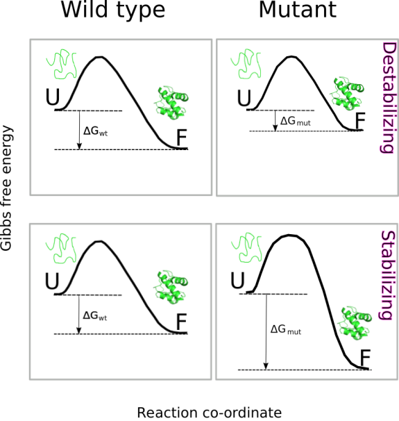

```{r setup, include=FALSE}
knitr::opts_chunk$set(echo = TRUE)
library(ptm)
library(knitr)
```

The well known glycolytic enzyme glyceraldehyde-3-phosphate dehydgrogenase (GAPDH), once considered a simple "housekeeping" protein, has been revealed, during the last three decades, as a prominent [moonlighting protein](https://en.wikipedia.org/wiki/Protein_moonlighting). Thus, GAPDH has been involved in diverse processes such as DNA repair, tRNA export, cytoskeletal dynamics, membrane fusion and transport, and cell fate, to mention a few.

Alineamiento de GAPDHs
```{r}
k <- id.mapping("P04406", from = 'uniprot', to = 'kegg')
S <- shannon(target = k, species = "seven")
```

The first time pdb = '1u8f' then pdb = './1u8f_Repair.pdb'

```{r}
op <- foldx.assembly(pdb = "./1u8f_Repair.pdb",
                     mol1 = 'OP',
                     mol2 = 'QR')

```


### References
Schymkowitz et al (2005) [Nucl. Ac. Res. 33:W382-W388](https://www.ncbi.nlm.nih.gov/pubmed/15980494).

### Details

Thermodynamic stability is a fundamental property of proteins that influences protein structure, function, expression, and solubility. Not surprinsinly,  prediction of the effect of point mutations on protein stability is a topic of great interest in many areas of biological research, including the field of protein post-translational [modifications](https://academic.oup.com/bioinformatics/article/28/22/2905/240075). Consequentely, a wide range of strategies for estimating protein energetics has been developed. In the package _ptm_ we have implemented two popular computational approaches for prediction of the effect of amino acid changes on protein stability. 

On the one hand, **foldx.mut()** implements [FoldX](https://www.ncbi.nlm.nih.gov/pubmed/15980494) (buildmodel and positionscan methods), a computational approach that uses a force field method and athough it has been proved to be satisfactorily accurate, it is also a time-consuming method. On the other hand, [I-Mutant](https://www.ncbi.nlm.nih.gov/pubmed/15980478) is a method based on machine-learning and it represents an alternative much faster to FoldX. The _ptm_ function that implements this last approach is **imutant()**.


Although using very different strategies, both functions assess 
the thermodynamic stability effect of substituting a single amino acid residue in the protein of interest. To do that, both function peform an estimation of the change in Gibbs free energy, $\Delta\Delta G$ (kcal/mol), for the folding process. That is, 

$\Delta\Delta G = \Delta G_{mut} - \Delta G_{wt}$

Where $\Delta G$ is the change in free energy corresponding to the folding of the protein from its unfolded state, either in the wild type (wt) or mutated (mut) version of the protein. Thus, a $\Delta\Delta G > 0$ implies a decrease in stability (destabilizing mutation) while a $\Delta\Delta G < 0$ is interpreted as an increase in stability (stabilizing mutation).



In the particular case of the function **ddG.ptm()**, a PDB model containing the modified residue is build and saved in the current directory. This, model is used to compute: 

$\Delta\Delta G = \Delta G_{modified} - \Delta G_{unmodified}$

Where $latex \Delta G_{modified}$ is the folding free energy of the protein containing the modified target residue. When interpreting results arising from the use of foldx.mut() a practical rule of thumb may be as follows:


To illustrate the use of **ddG.ptm()** we are going to use the human glyceraldehyde-3-phosphate dehydrogenase (GAPDH, PDB ID: 1U8F). To start, we will find out all the phosphorylatable sites in this protein: 

```{r}
sites <- ptm.scan("P04406")
psites <- sites[which(sites$p == TRUE), c(2,3,13)]
psites
```


As it can be observed in the table above, many of the phosphorylation sites described for GAPDH have been dectected in high-throughput experiments and therefore there is no evidence of their involvement in regulatory processes. To emphisize this fact, we are going to add a variable _regf_ taking two possible values: Y (for regulatory sites) and N (for non-regulatory sites)

```{r}
psites$regf <- NA 
psites$regf[which(psites$reg ==TRUE)] <- "Y"
psites$regf[is.na(psites$reg)] <- "N"
```

Now, with the help of **ddG.ptm()** we shall test the null hypothesis that the phosphorylation of regulatory and non-regulatory sites has the same effect on protein stability. So, we have to compute ΔΔG for all the PTMs:

```{r}
ddG <- data.frame(pos = psites$n, res = psites$aa, ptm = NA, DDG = NA, reg = psites$reg, regf = psites$regf)

for (i in 1:nrow(phos)){
  t <- phos$res[i]
  if (t == "S"){
    ddG$ptm[i] <- 'pSer'
  } else if (t == "Y"){
    ddG$ptm[i] <- 'pTyr'
  } else if (t == "T"){
    ddG$ptm[i] <- 'pThr'
  }
  ddG$DDG[i] <- ddG.ptm('./1u8f_Repair.pdb', 'O', pos = ddG$pos[i], ptm = ddG$ptm[i])
}
```

When the distribution of the ΔΔG values obtained is plotted:

```{r}
boxplot(as.numeric(ddG$DDG) ~ ddG$regf, ylab = expression(paste(Delta, Delta, "G (kcal/mol)", sep ="")),
        xlab = "Regulatory site?")
        
```

two conspicous conclusiones can be made: (i) most of the PTMs lead to destabilization, and (ii) it seems that regulatory phosphorylations are more destabilizing than their non-regulatory counterpart. In order to gain support for this last conclusion, let's carry out a t-student test:

```{r}
t.test(as.numeric(phos$DG) ~ phos$regf, mu = 0, alt = "less", conf = 0.95, var.eq  = F, paired  = F)
```

It seems that we can reject the null hypothesis that regulatory and non-regulatory have the same effect on the protein stability. Since, **ddG.ptm()** has built and saved the PDB models for each modification we have carried out, let's examine some of them. To this end, let's focus on the regulatory phosphorylation:

```{r}
ddG[which(ddG$reg), ]
```

Note how phosphorylation of Thr246 in a single subunt is strongly destabilizing (ΔΔG = 12.03 kcal/mol). It has been reported that phosphorylation of Thr246 by PKCδ inhibits [GAPDH-driven mitophagy](https://www.ncbi.nlm.nih.gov/pmc/articles/PMC3696670/). If we whish to explore the effect of this modification in a second subunit, we can repit the computation implemented by **ddG.ptm()**, but now passing as an argument the PDB file generated previously (the one incorporating pThr246 in one subunit):

```{r}
ppT246OP <- ddG.ptm(pdb = './1u8f_pThr246.pdb', ch = 'P', pos = 246, ptm = 'pThr')
ppT246OP
```

Thus, the change in thermodynamic stability after phosphorylation of two subunits would be of ΔΔG = 12.03 + 25.55 = 37.58 kcal/mol). The figure below helps to rationalize this result.


Warning: the function foldx() makes an extensive use of commands invoking the OS, reason why it may not work properly on Windows. 
