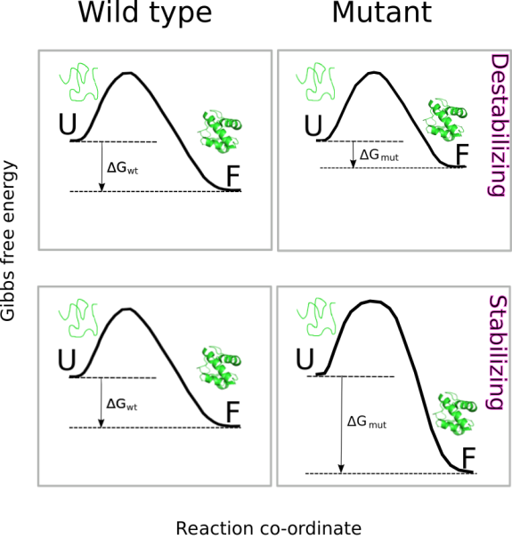
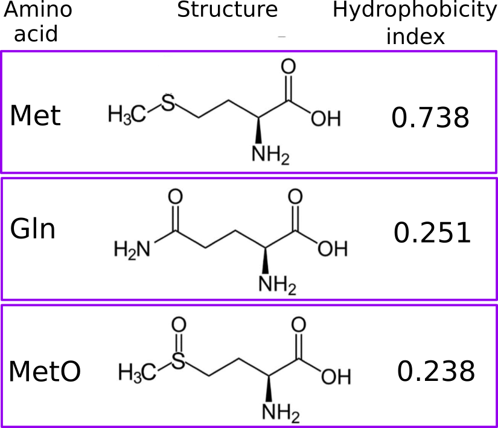
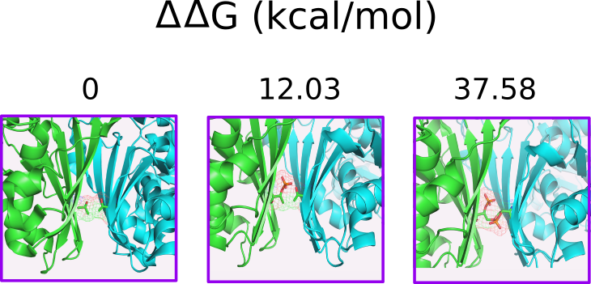

```{r setup, include=FALSE}
knitr::opts_chunk$set(echo = TRUE, results = "hide", warning = FALSE)
library(ptm)
library(knitr)
```


Thermodynamic stability is a fundamental property of proteins that influences protein structure, function, expression, and solubility. Not surprisingly,  prediction of the effect of point mutations on protein stability is a topic of great interest in many areas of biological research, including the field of protein post-translational [modifications](https://academic.oup.com/bioinformatics/article/28/22/2905/240075). Consequently, a wide range of strategies for estimating protein energetics has been developed. In the package _ptm_ we have implemented two popular computational approaches for prediction of the effect of amino acid changes on protein stability. 

On the one hand, **foldx.mut()** implements [FoldX](https://www.ncbi.nlm.nih.gov/pubmed/15980494) (buildmodel and positionscan methods), a computational approach that uses a force field method and although it has been proved to be satisfactorily accurate, it is also a time-consuming method. On the other hand, [I-Mutant](https://www.ncbi.nlm.nih.gov/pubmed/15980478) is a method based on machine-learning and it represents an alternative much faster to FoldX. The _ptm_ function that implements this last approach is **imutant()**.


Although using very different strategies, both functions assess 
the thermodynamic stability effect of substituting a single amino acid residue in the protein of interest. To do that, both function perform an estimation of the change in Gibbs free energy, $\Delta\Delta G$ (kcal/mol), for the folding process. That is, 

$\Delta\Delta G = \Delta G_{mut} - \Delta G_{wt}$

Where $\Delta G$ is the change in free energy corresponding to the folding of the protein from its unfolded state, either in the wild type (wt) or mutated (mut) version of the protein. Thus, a $\Delta\Delta G > 0$ implies a decrease in stability (destabilizing mutation) while a $\Delta\Delta G < 0$ is interpreted as an increase in stability (stabilizing mutation).

<br>
<br>

<br>
<br>

In the particular case of the function **ddG.ptm()**, a PDB model containing the modified residue is built and saved in the current directory. This, model is used to compute: 

$\Delta\Delta G = \Delta G_{modified} - \Delta G_{unmodified}$

Where $latex \Delta G_{modified}$ is the folding free energy of the protein containing the modified target residue. When interpreting results arising from the use of **foldx.mut()** or **ddG.ptm()** (both based on the FoldX suit) a practical rule of thumb may be as follows:

<br>
<br>

<br>
<br>

Currently, the target residues for the modifications implemented into **ddG.ptm()** are Ser, Thr and Tyr, which are phosphoacceptors and therefore, they are modified to pSer, pThr and pTyr. Another modification addressed by **ddG.ptm()** is the oxidation of Met to methionine sulfoxide (MetO). However, in the latter case the PDB model containing the modified residue will introduce, in the place of the target Met, either Gln or Thr instead of MetO (since MetO is not an option offered by FoldX). Oxidation of methionine adds polarity to an otherwise apolar side chain. More concretely, the side chain hydrophobicity index decreases from 0.738 (Met) to 0.238 (MetO) after the sulfoxidation reaction. Not surprisingly, polar amino acids such as Gln (hydrophobicity index of 0.251) and Thr (0.450) can sometimes [mimic the sulfoxidized state](https://www.ncbi.nlm.nih.gov/pubmed/30322141) of a protein. Furthermore, we also have evidence that [nature may also employ this "trick"](https://onlinelibrary.wiley.com/doi/abs/10.1002/pro.3698), but in reverse: evolving methionine sites from glutamine and threonine residues.



## ddG.ptm dependency 

The function **ddG.ptm()** requires computations that are carry out by an external program: FoldX. You can easily download the software (which requires free registration) [here](http://foldxsuite.crg.eu). After you have installed FoldX and added the binary location to PATH environment variable, you’re done! Nevertheless, if you are interested in the FoldX suite, you may wish to consult its [manual](http://foldxsuite.crg.eu/documentation).


## ddG.ptm and Methionine Sulfoxidation

As a protein model we are going to use Alpha-1-antitrypsin (P01009), which presents 9 methionine residues in its mature form, the oxidation of two of which (M351 and M358) has been described to cause loss of [anti-neutrophil elastase activity](https://www.ncbi.nlm.nih.gov/pubmed/10867014). We will assess the effect on stability of the modification of the 9 methionine residues:

```{r}
seq <- get.seq('P01009', db = 'metosite')
met <- gregexpr('M', seq)[[1]]
meto <- lapply(met, function(x) ddG.ptm('3cwm', pos = x, 'A', ptm = "MetO-Q"))
meto <- as.numeric(unlist(meto))
```


```{r, results="markup"}
barplot(meto, horiz = TRUE, 
        ylab = "Modified Met", 
        xlab = expression(paste(Delta, Delta, "G (kcal/mol)", sep = "")),
        col = c(rep("red", 5), "blue", "blue", "red", "red"),
        names.arg = met, cex.names = 0.6)
```

It is interesting to note that, while most of the methionine residues from alpha-1-antitrypsin destabilize the protein when oxidized, the effect is the opposite for the two methionine resides (M351 and M358) whose oxidation has been described to  cause loss of [anti-neutrophil elastase  activity](https://www.ncbi.nlm.nih.gov/pubmed/10867014). We can observe that the modification of M351 and M358 has a neutral to slightly stabilizing effect. 

## ddG.ptm and Phosphorylation

Now, to illustrate the use of **ddG.ptm()** in the context of phosphorylation, we are going to use the human glyceraldehyde-3-phosphate dehydrogenase (GAPDH, PDB ID: 1U8F). To start, we will find out all the phosphorylatable sites in this protein: 

```{r}
sites <- ptm.scan("P04406")
```

```{r, results="markup"}
psites <- sites[which(sites$p == TRUE), c(2,3,13)]
psites
```


As it can be observed in the table above, many of the phosphorylation sites described for GAPDH have been dectected in high-throughput experiments and therefore there is no evidence of their involvement in regulatory processes. To emphisize this fact, we are going to add a variable _regf_ taking two possible values: Y (for regulatory sites) and N (for non-regulatory sites)

```{r, results="markup"}
psites$regf <- NA 
psites$regf[which(psites$reg == TRUE)] <- "Y"
psites$regf[is.na(psites$reg)] <- "N"
```

Now, with the help of **ddG.ptm()** we shall test the null hypothesis that the phosphorylation of regulatory and non-regulatory sites have the same effect on protein stability. So, we have to compute ΔΔG for all the PTMs:

```{r}
ddG <- data.frame(pos = psites$n, res = psites$aa, ptm = NA, DDG = NA, reg = psites$reg, regf = psites$regf)

for (i in 1:nrow(psites)){
  t <- psites$aa[i]
  if (t == "S"){
    ddG$ptm[i] <- 'pSer'
  } else if (t == "Y"){
    ddG$ptm[i] <- 'pTyr'
  } else if (t == "T"){
    ddG$ptm[i] <- 'pThr'
  }
#  ddG$DDG[i] <- ddG.ptm('./1u8f_Repair.pdb', 'O', pos = ddG$pos[i], ptm = ddG$ptm[i])
  ddG$DDG[i] <- ddG.ptm('1U8F', 'O', pos = ddG$pos[i], ptm = ddG$ptm[i])
}
```

When the distribution of the ΔΔG values obtained is plotted:

```{r, results="markup"}
boxplot(as.numeric(ddG$DDG) ~ ddG$regf, ylab = expression(paste(Delta, Delta, "G (kcal/mol)", sep ="")),
        xlab = "Regulatory site?")
```

two conspicuous conclusions can be made: (i) most of the PTMs lead to destabilization, and (ii) it seems that regulatory phosphorylations are more destabilizing than their non-regulatory counterpart. In order to gain support for this last conclusion, let's carry out a t-student test:

```{r, results="markup"}
t.test(as.numeric(ddG$DDG) ~ ddG$regf, mu = 0, alt = "less", conf = 0.95, var.eq  = F, paired  = F)
```

It seems that we can reject the null hypothesis that regulatory and non-regulatory have the same effect on the protein stability. Since, **ddG.ptm()** has built and saved the PDB models for each modification we have carried out, let's examine some of them. To this end, let's focus on the regulatory phosphorylation:

```{r, results="markup"}
ddG[which(ddG$reg), ]
```

Note how phosphorylation of Thr246 in a single subunit is strongly destabilizing (ΔΔG = 12.03 kcal/mol). It has been reported that phosphorylation of Thr246 by PKCδ inhibits [GAPDH-driven mitophagy](https://www.ncbi.nlm.nih.gov/pmc/articles/PMC3696670/). If we whish to explore the effect of this modification in a second subunit, we can repit the computation implemented by **ddG.ptm()**, but now passing as an argument the PDB file generated previously (the one incorporating pThr246 in one subunit):

```{r, results="markup"}
ppT246OP <- ddG.ptm(pdb = './1u8f_pThr246.pdb', ch = 'P', pos = 246, ptm = 'pThr')
ppT246OP
```

Thus, the change in thermodynamic stability after phosphorylation of two subunits would be of ΔΔG = 12.03 + 25.55 = 37.58 kcal/mol). The figure below helps to rationalize this result.

<br>
<br>

<br>
<br>


A short note before finishing. Sometimes phosphoproteins can be crystallized and resolved (see Table 1 from the review [Structural Basis for Control by Phosphorylation](https://www.ncbi.nlm.nih.gov/pubmed/11749371)). Thus, if you have a PDB file containing phosphoresidues, you may be able to assess the effect of dephosphorylation on the protein stability:

```{r, results="markup"}
rev <- ddG.ptm(pdb = '1JST', ch = 'A', pos = 160, ptm = 'pThr', dir = 'b')
rev
```


